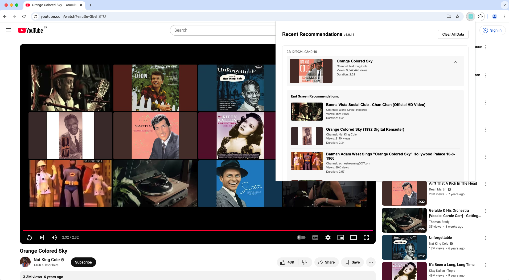

# Youreco

A Chrome extension that tracks YouTube video recommendations shown after video completion. Keep track of what YouTube suggests when you finish watching videos!

  
    
  

    
    
  

## Features

- 📝 Automatically captures end screen recommendations when videos finish
- 🎥 Shows source video details (title, channel, views, duration)
- 📊 Displays recommended video information including:
  - Video title and thumbnail
  - Channel name
  - View count
  - Duration
- 🔄 Real-time updates without needing to refresh
- 💾 Stores up to 100 most recent video recommendations
- 🎯 Clean and intuitive user interface

## Installation

1. Clone this repository or download the source code
2. Open Chrome and navigate to `chrome://extensions/`
3. Enable "Developer mode" in the top right
4. Click "Load unpacked" and select the extension directory

## Usage

1. Watch YouTube videos normally
2. When a video ends, Youreco will automatically capture the end screen recommendations
3. Click the extension icon to view your recommendation history
4. Click on any source video to expand/collapse its recommendations
5. Click video titles to open them in YouTube

## Technical Details

- Built with vanilla JavaScript
- Uses Chrome Extension Manifest V3
- Stores data using Chrome's storage.local API
- Monitors YouTube's video player state changes
- Handles Single Page Application (SPA) navigation

## Storage

The extension uses Chrome's `storage.local` API for data persistence:

- Has a maximum size limit (usually around 5MB)
- Persists between browser sessions
- Is synchronized between all instances of your extension
- Can be accessed from any extension script (background, content, popup)

## Development

The extension consists of:
- `manifest.json`: Extension configuration
- `background.js`: Handles storage and background tasks
- `content.js`: Interacts with YouTube page and captures recommendations
- `popup.html/js`: User interface for viewing recommendation history

## License

[MIT License](LICENSE) - feel free to use and modify as needed!

## Contributing

Contributions are welcome! Please feel free to submit a Pull Request.
